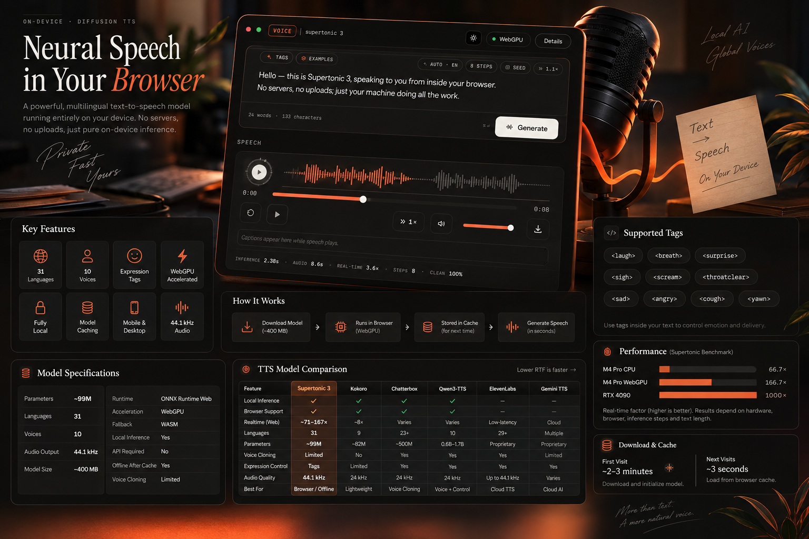

# MJ Browser Based TTS — Supertonic 3


> **Your browser. Your GPU. Your voice.**  
> Private neural TTS running entirely on-device.

Supertonic 3 is downloaded once, loaded with **WebGPU**, and cached locally.  
After that, MJ can reload the model in **~3 seconds** and generate speech without a server.

---

## ⚡ At a Glance



|                        |                                       |
| ---------------------- | ------------------------------------- |
| 🌍 **Languages**       | **31**                                |
| 🚀 **Published speed** | **~71–167× realtime***              |
| 🧠 **Parameters**      | **~99M**                             |
| 🎧 **Audio**           | **44.1 kHz**                          |
| 🎙️ **Voices**         | **10**                                |
| 💾 **Model**           | **~400 MB**                          |
| 🔒 **Inference**       | **100% Local**                        |
| ⚡ **Acceleration**     | **WebGPU**                            |
| 📱 **Target**          | **Browser · Mobile · Desktop · Edge** |

---

## 🎧 Demo

### 📰 Breaking News

<audio controls preload="metadata" src="assets/breaking_news.wav"></audio>

### 🇮🇳 Desi Bilingual Chat

<audio controls preload="metadata" src="assets/Desi%20bilingual%20chat.wav"></audio>

### 🌍 Multilingual Meetup

<audio controls preload="metadata" src="assets/Multilingual%20meetup.wav"></audio>

### 📖 Story Based

<audio controls preload="metadata" src="assets/story_based.wav"></audio>

---

<details>
<summary>🔘 Click to expand — ✨ Features</summary>

## ✨ What MJ Gives You

**🌍 Multilingual** — 31 languages

**🎭 Expressive** — built-in speech tags

**⚡ GPU Accelerated** — WebGPU inference

**🔒 Private** — text never needs to leave the device

**💾 Cache Once** — download once, reuse locally

**📱 Lightweight** — designed around a ~99M parameter model

</details>

---

<details>
<summary>🔘 Click to expand — 🎭 Expression Tags</summary>

## 🎭 Expression Tags

```text
<laugh>  <breath>  <surprise>  <sigh>  <sad>
<angry>  <scream>  <cough>    <yawn>  <throatclear>
```

</details>

---

<details>
<summary>🔘 Click to expand — ⚔️ TTS Comparison</summary>

# ⚔️ TTS Landscape

| Capability | **MJ / Supertonic 3** | **Kokoro** | **Chatterbox** | **Qwen3-TTS** | **ElevenLabs** | **Gemini TTS** |
| --- | --- | --- | --- | --- | --- | --- |
| **Local** | ✅ | ✅ | ✅ | ✅ | ❌ | ❌ |
| **Browser** | **✅ WebGPU** | ✅ | ⚠️ | ⚠️ | ❌ | ❌ |
| **Realtime** | **~71–167×*** | Fast | Hardware dependent | Fast | Low-latency API | Cloud |
| **Languages** | **31** | ~9 | 23+ | 10 | 29+ | Multiple |
| **Params** | **~99M** | 82M | ~500M | 0.6B–1.7B | — | — |
| **Voices** | 10 | 50+ | Limited | Several | Many | Several |
| **Cloning** | ⚠️ Limited | ❌ | ✅ | ✅ | ✅ | Limited |
| **Expression** | ✅ Tags | Limited | ✅ | ✅ | ✅ | ✅ |
| **44.1 kHz** | **✅** | ❌ | ❌ | ❌ | ✅ | — |
| **Offline** | **✅** | ✅ | ✅ | ✅ | ❌ | ❌ |
| **API** | **❌** | ❌ | ❌ | ❌ | ✅ | ✅ |
| **Best fit** | **Browser / Edge / Offline** | Lightweight TTS | Cloning | Voice + Control | Cloud TTS | Cloud AI |

</details>

---

<details>
<summary>🔘 Click to expand — 🚀 Speed / Realtime</summary>

## 🚀 Speed

**RTF = Real-Time Factor**

```text
Lower RTF = Faster

0.014 ────────────────► ~71× realtime
0.007 ────────────────► ~143× realtime
0.006 ────────────────► ~167× realtime
```

Published Supertonic WebGPU benchmark:

| Hardware | Short | Mid | Long |
| --- | ---: | ---: | ---: |
| M4 Pro CPU | 66.7× | 76.9× | 83.3× |
| **M4 Pro WebGPU** | **71.4×** | **142.9×** | **166.7×** |
| RTX 4090 | 200× | 500× | 1000× |

> *Benchmark results depend on hardware, browser, inference steps, text length and WebGPU implementation.*

</details>

---

<details>
<summary>🔘 Click to expand — 💾 One Download. Then Local.</summary>

```text
FIRST VISIT

████████████████████  ~400 MB
        ↓
   Model cached
        ↓
  Generate locally

NEXT VISIT

Cache
 ↓
⚡ ~3 sec startup
 ↓
🔊 Speech
```

</details>

---

<details>
<summary>🔘 Click to expand — 🔐 Privacy by Architecture</summary>

```text
               YOUR DEVICE

Text ─────► Supertonic 3 ─────► Audio
                 │
               WebGPU
```

**No upload · No API key · No TTS server · No per-request cloud inference**

</details>

---

<details>
<summary>🔘 Click to expand — 📌 Why Supertonic 3?</summary>

> **Big enough to sound good. Small enough to live in your browser.**

```text
~99M params
     +
31 languages
     +
44.1 kHz
     +
WebGPU
     +
Local cache
     ↓
Browser-native TTS
```

</details>

---

<details>
<summary>🔘 Click to expand — 👍 Pros & Cons</summary>

## 👍 / 👎

| ✅ Strengths | ⚠️ Trade-offs |
| --- | --- |
| ~99M parameters | ~400 MB first download |
| 31 languages | WebGPU varies by device |
| ~71–167× published WebGPU speed | WASM fallback is slower |
| 44.1 kHz | 10 bundled voices |
| Fully local | Less voice control than large models |
| Offline after cache | Voice cloning isn't the core workflow |
| Mobile / edge friendly | Actual speed depends on hardware |

</details>

---

<details>
<summary>🔘 Click to expand — 🛠️ Built With</summary>

`Supertonic 3` · `ONNX Runtime Web` · `WebGPU` · `Web Audio API` · `JavaScript / TypeScript`

</details>

---

> **MJ Browser Based TTS**  
> *Download once. Cache locally. Speak privately.*

### Credits

Built with **Supertonic 3** by Supertone.

[Supertonic — official archived repository](https://github.com/supertone-oss-archive/supertonic-py?utm_source=chatgpt.com)

Supertonic 3 is an open-weight, on-device TTS system supporting 31 languages, browser/WebGPU runtimes, CPU execution, 44.1 kHz audio, and 10 built-in voices.
